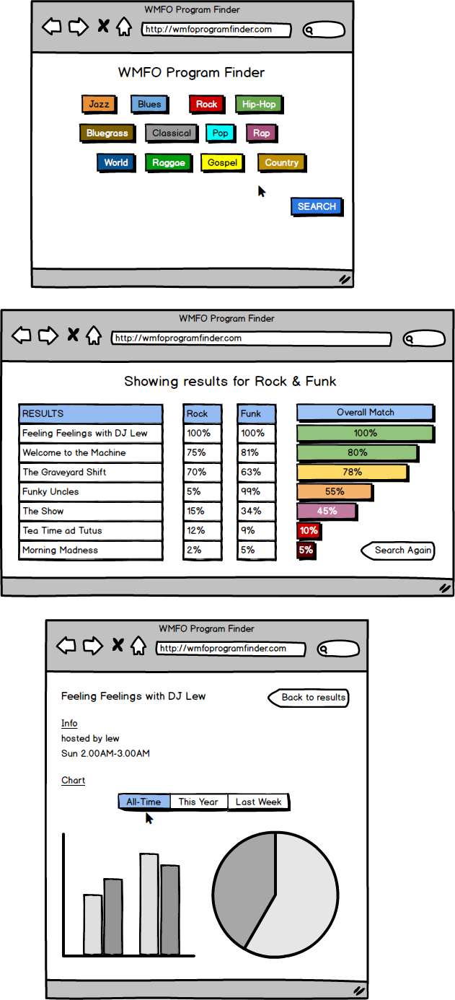

#WMFO Program Finder

##Problem Statement:

It's hard to know which WMFO radio programs play the music you like.  

##Solution:

An application that uses data from WMFO playlists to create informative charts and graphs that show which genres of music are popular on a given Tufts program.  Users can search for programs that match their taste in music.     

##Features:

###Pick 5: 
1. Client-side data persistence 
2. Front-end framework (Bootstrap)
3. Data/screen scraping (to get playlist data from the WMFO site)
4. Reporting with charts and graphs (Google charts API)
5. Server-side data persistence (to gather data on user preferences)

Users can select up to three genres they like from a list of possible genres.  The application will return a list of relevant radio programs that play the chosen genres, along with a percentage that represents how well they match. This percentage will be based on data from the current academic year. Results will be ordered by how relative they are to the search.  When a user clicks on one of the results, they can view graphs representing the percentage of each genre the station plays.  Graphs will show all-time data throughout the history of the program, as well as more specific time frames.   

##Data:

###API:
1. Google charts API - Used to display charts and graphs showing most-played genres for a given program.
2. Last.fm API - Retrieve genre for a given song using title and artist info.  Last.fm provides "tags" that we can match to specific genres we choose.   

We will also be using data from the WMFO playlists provided on their website, such as song titles, artists, and general program info (host name, program name, etc). A link to the WMFO site will be provided so users can listen to the programs. 

##Algorithms/Techniques: 
1. A sorting algorithm to order the results based on how well they match the user's search. 
2. Data scraping.
3. Generating percentages for searches.  

##Mock-ups:

#Comments by Ming
* Very cool and original idea!
